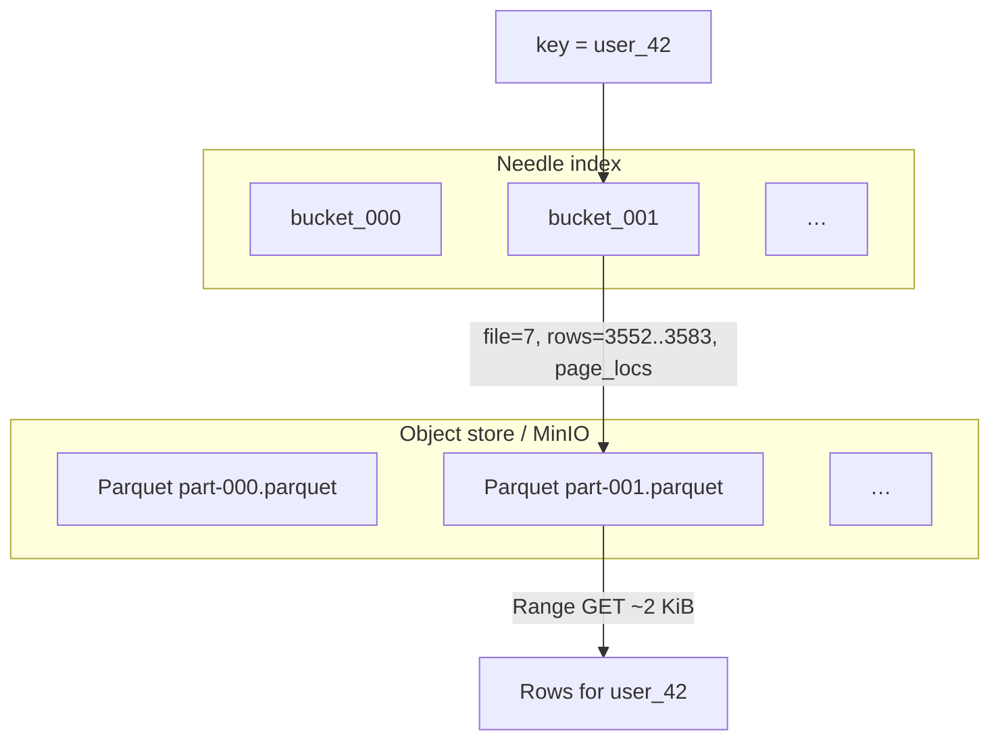
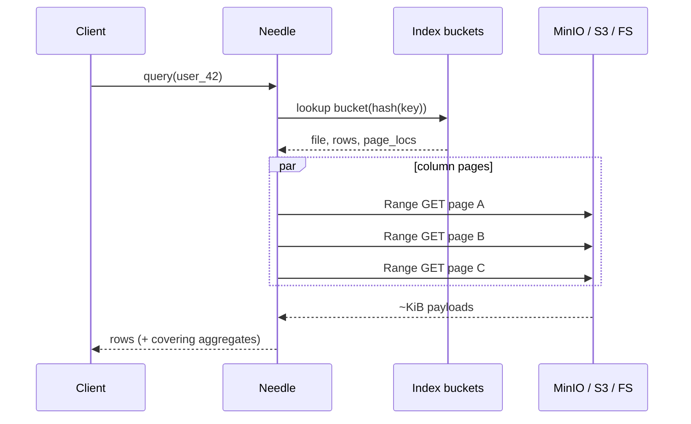

# Needle

**Point queries on your data lake — without copying it into a KV store.**

Needle is an external **key → file + page** index over ordinary Parquet. Look up a key, issue a handful of precise object-storage Range GETs, decode only those pages. Same files BigQuery / Spark / DuckDB already scan; no second copy of the data.

Inspired by Spotify’s [Random Access Parquet (RAP)](https://engineering.atspotify.com/2026/7/indexing-the-data-lake-for-online-point-queries) write-up. This repo is a faithful Rust recreation + local MinIO lake stress harness.

```bash
cargo build --release
./target/release/rap demo --key user_0042
```

(CLI binary is still named `rap` — Needle is the project name.)

---

## Why it exists

Online services and agents need **per-key** reads (one user, one entity) at interactive latency. Lakes are cheap and huge; distributed SQL is built for scans. The expensive part is rarely the disk — it’s the **dependent discovery chain** inside each Parquet file:


Each arrow is another round-trip. Needle collapses that to: **index lookup → ranged reads**.

```mermaid
flowchart LR
  Q[Point query] --> I[Needle index O(1)]
  I --> M[Cached page locations]
  M --> R[Parallel Range GETs]
  R --> D[Decode matching rows]
```

---

## How it works

### External index

A multimap (hash-bucketed, append-only fragments):

| Field | Meaning |
|-------|---------|
| `key` | Lookup key (e.g. `user_id`) |
| `file` | Dictionary-encoded ordinal → Parquet path / `s3://…` URI |
| `row_numbers` | Rows for that key in the file |
| `value_count` | Optional — pagination without reading data |
| `page_locs` / `frame_locs` | Optional — byte ranges stored in the index |
| `covering` | Optional hoisted aggregates (counts, sums) |



### Reader path

1. Hash the key → load the one index bucket (lazy).
2. Resolve rows → page byte ranges (OffsetIndex and/or index-stored `page_locs`).
3. Issue **parallel** Range GETs (local file or S3/MinIO).
4. Decode only those pages; return rows (optional offset/limit).

### Prep modes (still valid Parquet where possible)

Sorting / co-grouping / one-page-per-key / blobs / covering indexes / secondary indexes / custom low-level writer for ZSTD frame-per-key, 4KB alignment, and interleaved layouts. See [`NOTES.md`](./NOTES.md) for the article fidelity checklist.

---

## Quick start

```bash
# Unit + E2E (no MinIO required for most tests)
cargo test

# Local demo: generate → index → query → bench
cargo run --release -- demo --key user_0042

# Article-wide demo (all prep modes + HTTP Range proof)
cargo run --release -- demo-full --key user_0042
```

### MinIO lake (optional stress)

Needle can speak S3 Range GET against a **local** MinIO (no cloud account):

```bash
# downloads tools/minio + tools/mc on first run if missing
cargo run --release -- minio-up
cargo run --release -- lake-generate-fat --files 16 --rows-per-file 250000
cargo run --release -- lake-query user_0 --index data/rap-lake-index-fat
cargo run --release -- lake-stress --index data/rap-lake-index-fat-300k --queries 10000 --concurrency 32
```

We routinely stress **hundreds of thousands** of multi-page objects on one box; expect tens of GiB of disk if you go there.

---

## Architecture sketch



**Two stress axes this repo exercises:**

1. **Many files** — index picks 1 of N objects (N → 10⁵–10⁶).
2. **Fat files** — Range GET pages so `bytes_ranged / file_size` ≪ 1%.

---

## Project layout

```
src/
  main.rs              CLI
  index.rs             External Needle / RAP index
  metadata.rs          Footer + OffsetIndex → page ranges
  query.rs             Point query + naive baseline
  writer.rs            Sample lake writers (sorted / cogrouped / …)
  storage.rs           RangeReader trait (local + HTTP)
  s3.rs                Path-style S3 / MinIO SigV4 + Range GET
  lake.rs              Lake generate / index / query / stress
  secondary.rs         Hash + sorted secondary indexes
  parquet_lowlevel/    Custom page writer (frames, align, interleaved, paged)
tests/                 Unit-adjacent E2E + MinIO smoke
NOTES.md               Article mapping & fidelity notes
```

---

## Status / honesty

- **Implemented:** external index, page-accurate ranged reads, covering + secondary indexes, HTTP/S3 Range, MinIO lake harness, broad unit/E2E suite.
- **Custom Parquet prep** (ZSTD multi-frame pages, skippable alignment, interleaving) uses a low-level writer so layouts live **inside** `.parquet` files readable by Arrow.
- This is an R&D recreation, not Spotify’s production RAP.

Apache-2.0.

---

## References

- Will Edwards, Spotify Engineering — [*Indexing the Data Lake for Online Point Queries*](https://engineering.atspotify.com/2026/7/indexing-the-data-lake-for-online-point-queries) (2026)
